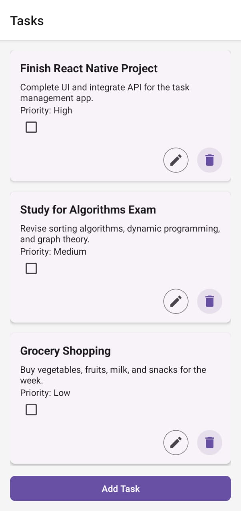

# Task Management App

A simple and intuitive Task Management App built with **React Native (Expo)**, **Redux Toolkit**, and **React Native Paper**. This app allows users to add, edit, delete, and mark tasks as completed. It also includes smooth animations, professional styling, and local persistence using `AsyncStorage`.

---

## Features

- **Add Tasks**: Add new tasks with a title, description, and priority (Low, Medium, High).
- **Edit Tasks**: Modify existing tasks.
- **Delete Tasks**: Remove tasks with a confirmation modal.
- **Mark Tasks as Completed**: Toggle task completion status with a checkbox.
- **Task List**: View all tasks in a scrollable list with professional styling.
- **Local Persistence**: Tasks are saved locally using `AsyncStorage`.
- **Smooth Animations**: Fade-in animations for error messages and delete confirmation modals.
- **Responsive Design**: Works seamlessly on both iOS and Android.

---

## Screenshots

### Task List Screen


### Add/Edit Task Screen


### Delete Confirmation Modal


---

## Tech Stack

- **Frontend**: React Native (Expo)
- **State Management**: Redux Toolkit
- **UI Library**: React Native Paper
- **Navigation**: React Navigation
- **Local Storage**: AsyncStorage
- **Animations**: React Native Animated API

---

## Installation

Follow these steps to set up and run the project locally.

### Prerequisites

- Node.js (v16 or higher)
- Expo CLI (install globally using `npm install -g expo-cli`)
- Android/iOS emulator or a physical device with the Expo Go app installed.

### Steps

1. **Clone the repository**:
   ```bash
   git clone https://github.com/Tapu-Parida2004/task-management-app.git
   cd task-management-app
   npm install
   ```
2. **npm install**
   Start the development server:
   ```bash
   npm start
   ```
3. **Run the app:**
   Scan the QR code with the Expo Go app (Android/iOS).
   Alternatively, press i (iOS) or a (Android) to run the app in an emulator.

## Project Structure

- **task-management-app/**
- **├── assets/             # Static assets (images, icons, etc.)**
- **├── navigation/         # React Navigation setup**
- **│ └── AppNavigator.js   # Stack navigator for screens**
- **├── redux/              # Redux state management**
- **│ ├── store.js          # Redux store configuration**
- **│ └── tasksSlice.js     # Redux slice for tasks**
- **├── screens/            # App screens**
- **│ ├── AddEditTaskScreen.js # Screen for adding/editing tasks**
- **│ └── TaskListScreen.js # Screen for displaying tasks**
- **├── App.js              # Root component**
- **├── LICENSE             # MIT License file**
- **├── screenshots         # screenshots**
- **└── README.md           # Project documentation**

## Usage

1. **Adding a Task**
   Click the "Add Task" button on the Task List screen.

   Fill in the title, description, and select a priority.

   Click "Save" to add the task.

2. **Editing a Task**
   Click the "Edit" button on a task card.

   Modify the task details.

   Click "Save" to update the task.

3. **Deleting a Task**
   Click the "Delete" button on a task card.

   Confirm the deletion in the modal.

4. **Marking a Task as Completed**
   Click the checkbox on a task card to toggle its completion status.

## Code Highlights

# Redux Slice (tasksSlice.js)

1. Manages the state for tasks.

2. Includes actions for adding, editing, deleting, and toggling tasks.

3. Persists tasks locally using AsyncStorage.

**javascript**
export const initializeTasks = () => async (dispatch) => {
  const tasks = await loadTasksFromStorage();
  dispatch(loadTasks(tasks));
};

# Task List Screen (TaskListScreen.js)

1. Displays tasks in a scrollable list.

2. Includes a delete confirmation modal with smooth animations.

**javascript**
const renderTask = ({ item }) => (
  <Card style={styles.card}>
    <Card.Content>
      <Text style={styles.title}>{item.title}</Text>
      <Text>{item.description}</Text>
      <Text>Priority: {item.priority}</Text>
      <Checkbox
        status={item.completed ? 'checked' : 'unchecked'}
        onPress={() => dispatch(toggleTaskCompletion(item.id))}
      />
    </Card.Content>
    <Card.Actions>
      <Button onPress={() => navigation.navigate('AddEditTask', { task: item })}>Edit</Button>
      <Button onPress={() => openDeleteModal(item.id)}>Delete</Button>
    </Card.Actions>
  </Card>
);

# Add/Edit Task Screen (AddEditTaskScreen.js)
1. Handles task creation and editing.

2. Includes validation with animated error messages.

**javascript**
const handleSave = () => {
  setTitleError(!title.trim());
  setDescriptionError(!description.trim());

  if (!title.trim() || !description.trim()) {
    Alert.alert(
      'Validation Error',
      'Please fill in both the title and description fields.',
      [{ text: 'OK' }]
    );
    return;
  }

  const newTask = {
    id: task?.id || Date.now(),
    title,
    description,
    priority,
    completed: task?.completed || false,
  };

  if (task) {
    dispatch(editTask(newTask));
  } else {
    dispatch(addTask(newTask));
  }
  navigation.goBack();
};

## License

This project is licensed under the **MIT License**. See the [LICENSE](LICENSE) file for details.

## Acknowledgments
1. **React Native for the framework.**

2. **Redux Toolkit for state management.**

3. **React Native Paper for UI components.**

4. **Expo for development tools.**
